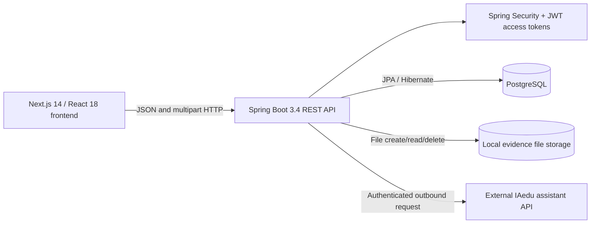

# System Overview

**Implementation snapshot:** 19 June 2026  
**Evidence basis:** current source tree and worktree, backend test suite, and frontend production build. Existing project documentation was treated as potentially outdated.

## Status vocabulary

- **Implemented:** present in the current code and reachable through an API or user interface.
- **Partially implemented:** a usable path exists, but important behavior, validation, authorization, or interface support is incomplete.
- **Deprecated/legacy:** retained for compatibility but no longer part of the primary user flow.
- **Not implemented:** no current code path was found.
- **Inferred:** behavior follows from code structure or persistence logic and should be confirmed manually.
- **Uncertain:** the code does not provide enough evidence; a manual runtime check is recommended.

## Purpose

The platform represents domain-specific maturity or capability models in a common hierarchy and uses an active model to run self-assessments. Its current implementation supports:

- organizing models by domain;
- defining versioned model structures and maturity scales;
- running questionnaire-style assessments;
- saving and resuming response drafts;
- collecting file evidence;
- automatically scoring configured answer types;
- routing non-automatic models to curator review;
- displaying and exporting completed results;
- managing user access and roles.

Although the platform is domain-agnostic at the software level, each assessment
is tied to one exact maturity-model version in one selected domain. That version
must be active when a new assessment draft is created.

## Problem addressed

The system separates the reusable assessment mechanism from the subject matter being assessed. A curator can define a model made of dimensions, modules, practices, and questions without changing application code. A respondent can then execute the active version of that model, while the platform stores responses and calculates a maturity profile.

The implementation therefore addresses two connected needs:

1. **Model governance:** capture, validate, version, import, export, and activate maturity models.
2. **Assessment execution:** guide respondents through a model, preserve progress, collect supporting evidence, and produce or review results.

## Main user groups

| User group | Implemented role | Primary current activities |
|---|---|---|
| Respondent | `USER` | Register, log in after approval, conduct assessments, save drafts, submit, view/export own completed results, delete own assessments |
| Model curator/evaluator | `CURATOR` | All respondent activities plus domain/model management, viewing all assessments, reviewing pending assessments, and deleting any assessment |
| Administrator | `ADMIN` | All curator activities plus access-request approval/rejection and user-role management |
| Public API consumer | No authenticated role | Read domains and maturity models through public `GET` endpoints |

The deprecated database role `EVALUATOR` is migrated to `CURATOR` at startup; it is not a current role (`config/DataInitializer.java`).

## High-level architecture

### Frontend

The frontend uses the Next.js App Router and client-rendered pages. Authentication state is held in `AuthContext`; access and refresh tokens are stored in browser `localStorage`.

Relevant modules:

- routes and screens: `frontend/src/app/`;
- API client and refresh handling: `frontend/src/api/axios.ts`;
- shared contracts: `frontend/src/api/types.ts`;
- authentication state: `frontend/src/context/AuthContext.tsx`;
- common navigation and UI: `frontend/src/components/`.

### Backend

The backend uses controllers, services, JPA repositories, and entity models.

- authentication and administration: `backend/src/main/java/.../auth/`;
- model and domain management: `backend/src/main/java/.../maturity_models/`;
- assessment, scoring, and evidence: `backend/src/main/java/.../assessments/`;
- security and schema compatibility: `backend/src/main/java/.../config/`.

### Data and files

PostgreSQL stores users, model structures, assessment JSON, calculated results, and evidence metadata. Uploaded evidence files are stored below the configured local upload directory, grouped by assessment and question.

Schema evolution is split between Flyway migrations and runtime DDL/backfill logic in `DataInitializer`. This mixed strategy is implemented but increases deployment and reproducibility risk.

## Main modules and components

| Module | Current responsibility | Status |
|---|---|---|
| Authentication | Registration, approval-gated login, JWT access tokens, rotating refresh tokens | Implemented |
| User administration | Approve/reject access requests; edit roles; delete users | Implemented; backend-only admin user creation is not exposed in the UI |
| Domain management | Create, list, and delete domains without models | Implemented |
| Model catalog | Search, filter, group by version lineage, and inspect model versions | Implemented |
| Model editor | Manual creation, Excel import, hierarchy editing/reordering, validation, local browser drafts, version creation | Implemented; recently refactored and lacking frontend automated tests |
| Model publication | Activate or deactivate a version; one active version per model lineage, with multiple active model lineages allowed in a domain | Implemented |
| Assessment introduction | Select an active model, read instructions, and inspect its structure | Implemented |
| Questionnaire execution | Six question types, required questions, conditional dependencies, file evidence, navigation | Implemented with scale and evidence limitations |
| Assessment drafts | One server-side draft per user/model; save, leave, resume, or overwrite | Implemented |
| Automatic scoring | Weighted question/practice aggregation, dimension results, overall result | Implemented |
| Manual review | Curator scores Open Answers on the model maturity scale; scores normalize before aggregation | Implemented |
| Results | Dimension breakdown, evidence list/download, PDF/XLSX export | Implemented |
| Assistant | Dashboard chat backed by an external IAedu endpoint | Partially implemented; depends on external configuration/service availability |
| Agent report exchange | Export assessment JSON and import advisory JSON in curator review | Implemented as a manual external workflow, not an integrated agent |

## Current implementation status

The repository is buildable in the inspected environment:

- **Backend:** 56 tests passed across application startup, assessment lifecycle, JWT filtering, model versioning/validation, Excel round-tripping, and scoring.
- **Frontend:** the production build completed successfully for all 17 routes.

This confirms compilation and the tested service behaviors, but not end-to-end usability, accessibility, browser compatibility, or every authorization boundary.

## Main limitations and assumptions

1. **No explicit assessment target or scope entity.** The user selects a domain/model, but does not select an organization unit, project, team, time period, or other assessment target. Registration stores an organization name, but assessments do not reference it.
2. **Responses are stored as a JSON object.** There is no normalized answer entity, answer history, per-answer timestamp, author, comment thread, or change audit.
3. **Question-format normalization is incremental.** Boolean, Scale, multiple-choice, Numeric, and Percentage questions now use 0–1 internally. Open-answer scoring remains evaluator-driven.
4. **Evidence execution is file-only in the respondent UI.** The backend supports file and URL evidence, but no current respondent screen creates URL evidence or supplies evidence descriptions.
5. **Draft evidence is persisted.** Saved drafts restore up to five files or
   HTTPS links per answered question, including optional descriptions.
6. **Required-answer enforcement is primarily client-side.** The backend validates required evidence for answered visible questions, but does not reject a submission solely because a required question is unanswered.
7. **Module weight is represented but not used in scoring.** Effective scoring weight is question weight multiplied by practice weight. Overall score is the unweighted mean of dimension averages.
8. **No archive, duplicate, or submitted-assessment edit flow.** Models are versioned, but assessments can only be drafted, submitted/reviewed, viewed, exported, or deleted.
9. **Authorization/UI mismatches exist.** Some model-management pages expose controls without a frontend role guard and rely on backend rejection. Several access-denied handlers expect HTTP 403 while the backend currently emits HTTP 401.
10. **Evidence list authorization is incomplete.** Authenticated callers can request evidence metadata by assessment ID without a service-level ownership/curator check. File download is separately protected.
11. **Operational security defaults require remediation.** The current configuration contains hardcoded/default secrets and can enable trust-all TLS for the external assistant. These are unsuitable for an evaluation deployment containing real participant data.
12. **Existing documentation contains obsolete claims.** YAML upload, CSV result export, removed question types, immediate post-registration access, and globally or domain-wide singular model activation are examples not supported by the current implementation.

## Primary traceability references

- `frontend/src/app/assessment/page.tsx`
- `frontend/src/app/maturity-models/editor/`
- `frontend/src/app/evaluate/[id]/page.tsx`
- `frontend/src/app/results/ResultsContent.tsx`
- `backend/src/main/java/com/master_thesis/maturity_assessment/assessments/services/AssessmentService.java`
- `backend/src/main/java/com/master_thesis/maturity_assessment/maturity_models/services/MaturityModelService.java`
- `backend/src/main/java/com/master_thesis/maturity_assessment/config/SecurityConfig.java`
- `backend/src/main/resources/db/migration/`
