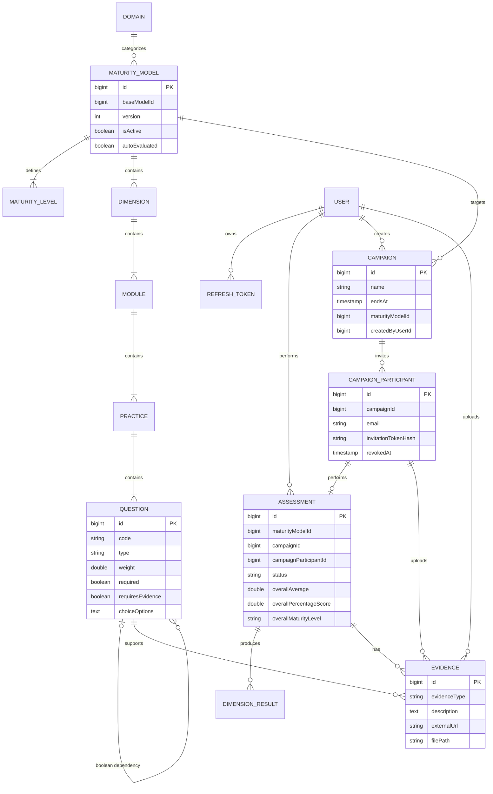

# Domain Model and Data Structure

**Implementation snapshot:** 26 July 2026

## Conceptual model

The implemented metamodel has two main branches:

- a **definition branch** for domains and versioned maturity models;
- an **execution branch** for users or campaign participants, assessments, responses, evidence, and calculated results.



`Assessment.maturityModelId` and `MaturityModel.baseModelId` remain scalar Java
identifiers. Migration V21 adds a database foreign key for
`Assessment.maturityModelId`.

## Model-definition entities

### Domain

`Domain` categorizes maturity models.

Important fields:

- `id`;
- unique `name`;
- optional `description`;
- creation/update timestamps.

The API adds derived model count and active-model indicators to `DomainDTO`.

Reference: `maturity_models/models/Domain.java`, `maturity_models/services/DomainService.java`.

### MaturityModel

`MaturityModel` is a complete, immutable-by-convention model version.

Important fields:

- `name`, `description`;
- `isActive`;
- `autoEvaluated`;
- `version`;
- `baseModelId`, linking all versions to the first version's ID;
- optional JPA relation to `Domain`;
- child `levels` and `dimensions`.

Editing an existing model does not modify it in place. The update/editor endpoint creates a new inactive row with the next lineage version number. Activation is a separate action.

**Inferred:** version immutability is a service convention rather than a database constraint; direct database changes could violate it.

Reference: `maturity_models/models/MaturityModel.java`, `maturity_models/services/MaturityModelService.java`.

### MaturityLevel

A model has an ordered scale of 2–12 levels.

Important fields:

- `number`;
- compatibility field `levelNumber`;
- `name`;
- optional `description`;
- parent model.

Both numeric fields are populated with the same value by current model writes. Their duplication appears to be legacy compatibility rather than two distinct concepts.

Validation requires contiguous level numbers from 1 to N.

### Dimension

A dimension is the highest-level scored grouping inside a model.

Important fields:

- database `id`;
- public/stable `dimensionId`;
- `name`, optional `description`;
- `sortOrder`;
- parent model and ordered modules.

Dimension results retain a snapshot of the public ID, name, and description used at assessment time.

### Module

A module groups practices inside a dimension.

Important fields:

- stable `code`;
- `name`, optional `description`;
- `weight`;
- `sortOrder`;
- parent dimension and child practices.

**Implementation difference:** module weight is stored and editable but is not applied by `AssessmentService` during scoring.

### Practice

A practice groups questions inside a module.

Important fields:

- database `id`;
- stable `code`;
- `name`, optional `description`;
- `weight`;
- parent module and ordered questions.

Practice order is currently list/database order; there is no explicit `sortOrder` field on `Practice`.

### Question

A question is the smallest model-definition unit used during assessment.

Important fields:

- database `id`;
- stable `code`;
- `sortOrder`;
- `text`, `help`;
- `type`;
- `weight`;
- `required`;
- `requiresEvidence`;
- optional self-reference `dependsOnQuestion`;
- `choiceOptions`, a JSON text field used for multiple-choice options;
- Scale configuration: `scalePointCount`, optional endpoint labels, and scoring direction;
- Numeric/Percentage configuration: inclusive integer bounds and scoring direction;
- parent practice.

Implemented question types:

| Type | Stored response | Scoring behavior |
|---|---|---|
| `boolean` | `0` or `1` | Curator-selected correct answer normalizes to 1; the other to 0 |
| `likert` | Integer point | Normalized linearly to 0–1 using independent point count and direction |
| `multiple_choice` | Configured normalized score | Option label maps to a curator-defined score from 0 to 1 |
| `numeric` | Integer | Normalized linearly to 0–1 within curator-defined bounds and direction |
| `percentage` | Integer | Normalized linearly to 0–1 within curator-defined bounds and direction |
| `open_answer` | Text plus evaluator score | Excluded from automatic scoring; evaluator selects level 1–N and the score normalizes linearly to 0–1 before aggregation |

Removed/legacy types such as `boolean_justification` and `evidence` are not accepted by current model validation.

Question dependencies:

- remain within one practice;
- target a boolean question;
- are represented by a stable code at the editor/API boundary and a database self-reference after persistence;
- cannot reference the question itself or form a cycle;
- display the dependent question only when the parent answer is Yes/`1`.

## Execution entities

### User

Important fields:

- `email`, used as username;
- BCrypt password hash;
- optional `name` and `organizationName`;
- `role`: `USER`, `CURATOR`, or `ADMIN`;
- `approvalStatus`: `PENDING` or `APPROVED`.

The entity implements Spring Security `UserDetails` and expands higher roles into inherited authorities.

### RefreshToken

Refresh tokens are opaque UUID values stored in the database with:

- owning user;
- expiry date;
- creation date;
- revocation flag.

Refresh rotates the token: the old record is marked revoked and a new token is created.

### Assessment

An assessment represents both a saved draft and a submitted assessment.

Important fields:

- exactly one respondent source: owner `User` or campaign and participant;
- scalar `maturityModelId`;
- `status`: `DRAFT`, `PENDING_REVIEW`, `CHANGES_REQUESTED`, or `COMPLETED`;
- compatibility flag `isCompleted`, synchronized from status;
- `overallAverage`;
- `overallPercentageScore`;
- `overallMaturityLevel`;
- optional `evaluatorInsight`;
- creation/update timestamps;
- child dimension results and evidence.

The same database row is reused when a saved draft is submitted.

For campaign assessments, composite foreign keys ensure that the participant
belongs to the campaign and that the assessment uses the campaign's exact
maturity-model version. One participant can own at most one assessment.

### Campaign

A campaign is created by one platform curator/admin and targets one exact
maturity-model version. It starts when created and remains usable until its
timezone-aware `endsAt` instant.

Participant invitations are normalized as `CampaignParticipant` rows rather
than stored as an ID array. Each row has a case-normalized email, a unique
SHA-256 invitation-token hash, and an optional revocation instant. Raw tokens
and full invitation URLs are not persisted.

Participant completion is derived from the linked assessment:

- `PENDING_REVIEW` or `COMPLETED`: completed;
- no assessment, `DRAFT`, or `CHANGES_REQUESTED`: incomplete.

Question evaluations need no campaign columns because their required
assessment relationship provides the campaign context.

### Response representation

`QuestionEvaluation` is the normalized response record. It links one assessment
to one canonical question and stores the respondent response, optional
justification, submitted initial score, and later curator review fields.

Current key format:

```text
{dimensionPublicCode}_{modulePublicCode}_{practiceDatabaseId}_{questionDatabaseId}
```

Autosave request shape:

```json
{
  "questionResponses": {
    "D1_GOV_M1_POLICY_42_105": {
      "questionId": 105,
      "response": 1
    },
    "D1_GOV_M1_POLICY_42_106": {
      "questionId": 106,
      "response": "A qualitative response"
    }
  }
}
```

`questionId` is canonical and protected by a foreign key. The composite key is
retained as a client correlation key.

Consequences of the normalized representation:

- autosave still submits one authoritative response snapshot;
- each response has database-level question identity and timestamps;
- initial automated and later manual scores remain distinct;
- curator review never overwrites the respondent response;
- uniqueness constraints prevent duplicate question rows per assessment.

Legacy `_justification` values were migrated into
`respondent_justification`; the current questionnaire does not render a
justification field.

### DimensionResult

One record is created for each dimension that has at least one valid scored response.

Fields:

- dimension public ID, name, and description;
- weighted `averageScore`;
- normalized `percentageScore`;
- mapped maturity-level name;
- count of scored questions;
- weighted total score;
- parent assessment.

Dimensions with no valid scored answers do not receive a `DimensionResult`.

### Evidence

Evidence metadata is normalized into its own entity.

Fields:

- parent assessment;
- referenced question;
- exactly one uploader: authenticated user or campaign participant;
- `evidenceType`: `FILE` or `URL`;
- required description;
- URL metadata or file name/path/size/type;
- upload timestamp.

File bytes are not stored in PostgreSQL. They are written under:

```text
{upload-directory}/{assessmentId}/{questionId}/{generated-file-name}
```

The respondent UI currently creates file evidence through a legacy multipart path. URL evidence and custom descriptions are supported by backend services and result/review displays, but no current respondent UI creates them.

For campaign evidence, a composite foreign key guarantees that the uploader is
the participant who owns the assessment. Anonymous campaign request handling
is intentionally deferred even though the persistence model is ready for it.

## Scoring representation

### Per-question conversion

`AssessmentService` converts valid response values into either normalized 0–1 scores or legacy maturity-level values, depending on question type. Invalid or out-of-range values return no score and are excluded rather than causing the submission to fail.

### Per-dimension aggregation

Current effective weight:

```text
question weight × practice weight
```

Current dimension average:

```text
sum(question score × effective weight) / sum(effective weight)
```

Module weight is not included.

### Overall aggregation

The overall average is the unweighted arithmetic mean of the calculated dimension averages. Dimensions without a calculated result are absent from that mean.

The average on the 1–N scale is normalized to 0–100:

```text
(average - 1) / (N - 1) × 100
```

The percentage is mapped to one of N equal-width bands. The resulting level number is resolved to the model's configured level name.

Reference: `assessments/services/AssessmentService.java`, `maturity_models/services/MaturityScoringService.java`.

## Model import/export structure

The current import/export format is `.xlsx`, not YAML or CSV.

Workbook sheets:

- `Model`;
- `Levels`;
- `Dimensions`;
- `Modules`;
- `Practices`;
- `Questions`.

The parser accepts some legacy optional columns and defaults missing legacy levels to a five-level scale. Imported models are loaded into the editor for review and saved inactive.

Reference: `maturity_models/services/MaturityModelExcelService.java`, `maturity_models/services/CsvParsingService.java`.

## Differences from a generic maturity metamodel

| Generic metamodel concern | Current representation |
|---|---|
| Assessment subject/target | Authenticated user or one invited campaign participant |
| Assessment scope | Domain selection only; no organizational unit, project, geography, or period |
| Respondent team/multiple assessors | One user or participant per assessment; no collaborators |
| Answer entity | `QuestionEvaluation` row per assessment/question |
| Answer status such as skipped/N/A | Not represented |
| Evidence review status | Not represented |
| Practice/module result entities | Not represented; only dimension and overall results |
| Thresholds per maturity level | Equal-width percentage bands, not model-defined thresholds |
| Scoring formula configuration | Fixed service logic with question/practice weights |
| Model lifecycle status | Boolean active/inactive plus lineage version; no draft/published/retired enum |
| Assessment audit trail | Creation/update timestamps only |
| Report entity | Not represented; PDF/XLSX are generated client-side on demand |
| Benchmarking/comparison | Not implemented |

## Data integrity and uncertainty notes

- Public code uniqueness is validated in service logic within each parent scope. Migration V6 also creates case-insensitive uniqueness indexes.
- One draft per user/model is enforced through a partial unique index from migration V16.
- One assessment per campaign participant and exact campaign/model membership are enforced by migration V21.
- A domain can contain multiple active model lineages. The service behavior and
  the partial unique index introduced by migration V23 allow only one active
  version within each lineage.
- Assessment-to-model linkage is a scalar Java ID backed by a database foreign key.
- Deleting an assessment cascades evidence metadata through JPA. **Inferred:** associated evidence files may remain on disk because assessment deletion does not call `FileStorageService.deleteFile`.
- Manual evaluation preserves respondent responses and submitted initial scores while storing overrides separately.

## Primary traceability references

- `backend/src/main/java/com/master_thesis/maturity_assessment/maturity_models/models/`
- `backend/src/main/java/com/master_thesis/maturity_assessment/assessments/models/`
- `backend/src/main/java/com/master_thesis/maturity_assessment/auth/models/`
- `backend/src/main/java/com/master_thesis/maturity_assessment/campaigns/models/`
- `backend/src/main/java/com/master_thesis/maturity_assessment/maturity_models/services/MaturityModelService.java`
- `backend/src/main/java/com/master_thesis/maturity_assessment/assessments/services/AssessmentService.java`
- `backend/src/main/resources/db/migration/V5__add_public_model_item_codes.sql`
- `backend/src/main/resources/db/migration/V6__normalize_legacy_item_codes_and_dependencies.sql`
- `backend/src/main/resources/db/migration/V7__add_question_sort_order.sql`
- `backend/src/main/resources/db/migration/V21__add_campaign_persistence.sql`
