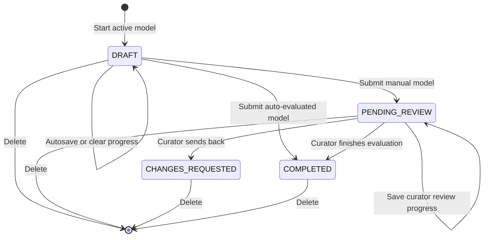

# Assessment Lifecycle

**Implementation snapshot:** 25 July 2026

## Lifecycle summary

An assessment row is created when the user starts an active model. The row is
autosaved throughout the questionnaire and reused at submission rather than
copied into a new record.



The respondent-side transition from `CHANGES_REQUESTED` back to an editable
state is intentionally not implemented yet.

## Statuses

### DRAFT

Meaning:

- respondent has started but not submitted the assessment;
- overall average and percentage are stored as `0`;
- overall maturity label is `"Draft"`;
- no dimension results are created by the draft-save method.

Rules:

- one draft per user and maturity-model version;
- starting the same exact model version returns the same row without clearing it;
- autosaving and starting over both update the same row;
- draft stores response rows in `question_evaluations` and an authoritative evidence snapshot;
- an abandoned start remains visible as a 0% draft;
- draft execution routes use `/assessment?draftId={id}` only.

### PENDING_REVIEW

Meaning:

- respondent submitted a model where `autoEvaluated` is false;
- preliminary score and dimension results have already been calculated;
- curator review is required before results are treated as final.

Rules:

- only `PENDING_REVIEW` assessments can save or finish evaluator reviews;
- an assessment cannot be reviewed twice;
- owner sees “Pending review” but cannot open final results from the normal assessment list;
- CURATOR/ADMIN can open it from `/evaluate`.

### CHANGES_REQUESTED

Meaning:

- a curator found at least one answer or evidence item that must be corrected;
- review classifications and notes remain stored on the assessment's
  `question_evaluations` rows;
- the assessment is no longer part of the evaluator's pending queue.

Rules:

- sending back requires at least one `FLAGGED` row;
- every flagged row must have a reviewer note;
- `isCompleted` remains false;
- accepted items are read-only for the respondent;
- flagged and adjusted items remain editable and retain the evaluator note;
- changing a reviewed item persists `respondentUpdated = true`;
- every flagged item must be updated before the assessment can be resubmitted;
- successful resubmission returns the same assessment to `PENDING_REVIEW`.

### COMPLETED

Meaning:

- automatic scoring completed at respondent submission, or
- curator completed a pending review.

Rules:

- result page and exports are available;
- assessment remains deletable;
- there is no reopen or amendment flow.

### `isCompleted` compatibility flag

The entity retains both `status` and `isCompleted`. Lifecycle methods synchronize the boolean to:

```text
isCompleted = (status == COMPLETED)
```

Migration V4 repairs rows where earlier lifecycle logic left status/flag inconsistent. `status` should be treated as authoritative.

## Creation and autosaving

### Ensure a draft at Start

`PUT /api/v1/assessments/drafts/by-model/{modelId}`:

1. requires the exact model version to exist and be active;
2. serializes concurrent starts for the user/model pair;
3. returns the existing `DRAFT` unchanged if one exists;
4. otherwise creates an empty `DRAFT` with placeholder score fields;
5. returns `200 AssessmentResponse` in either case.

The endpoint is idempotent: retrying Start never clears existing responses or
evidence. `POST /api/v1/assessments/drafts` remains available for compatibility,
but the respondent UI no longer uses it to create or update drafts.

A partial unique index enforces one draft per non-null user/model:

```text
ux_assessments_user_model_draft
```

The index is managed by Flyway migration
`V16__enforce_one_draft_per_user_and_model.sql`; application startup does not
issue duplicate runtime DDL for it.

### Draft resume

The frontend:

1. retrieves the draft as an assessment detail;
2. verifies `status === DRAFT`;
3. retrieves the exact model version referenced by the draft;
4. restores response JSON;
5. navigates to the first required-incomplete practice.

Persisted files, secure links, and descriptions are restored. New browser `File`
objects are replaced by persisted evidence metadata after each successful save,
so later saves do not upload the same file again.

### Start over

`PUT /api/v1/assessments/drafts/{draftId}/reset` requires ownership and `DRAFT`
status. It atomically clears responses and evidence while retaining the
assessment row and ID. Physical evidence files are deleted only after the reset
transaction commits. Drafts for inactive versions in the same model lineage are
left unchanged.

### Exact-draft autosave

`PUT /api/v1/assessments/drafts/{draftId}` accepts the authoritative multipart
response/evidence snapshot for that exact row. The backend rejects a draft owned
by another user, a submitted assessment, or a request whose model does not match
the draft; it never creates a fallback row.

The frontend:

1. marks an accepted answer or evidence edit dirty;
2. waits for one second of inactivity;
3. serializes saves so only one request is in flight;
4. coalesces edits made in flight into one trailing save;
5. exposes **Saving…**, **All changes saved**, or
   **Changes not saved · Retry** in an accessible navbar live region.

Entering review, selecting **Continue Later**, and submitting flush and await the
queue. Submission pauses autosave so a late request cannot move a submitted
assessment back to `DRAFT`. Dirty, saving, and failed states activate the browser
unload warning. Failed network saves can be retried explicitly, by the next edit,
or when connectivity returns.

Final submission is also exact-draft authoritative: it locks the supplied ID and
returns `409 Conflict` if that row has already left `DRAFT`. Retrying a completed
or otherwise stale submission never creates a replacement assessment.

Assessment execution requires a positive `draftId`. `/assessment`, nested
assessment routes without it, and legacy `?modelId=` routes redirect to
`/assessment/setup`.

## Response storage

Responses are stored as one row per assessment/question in
`question_evaluations`. `assessments` contains lifecycle and aggregate result
data only.

Current response key:

```text
dimensionCode_moduleCode_practiceDatabaseId_questionDatabaseId
```

Each row contains:

- a JSONB `response` containing a number, string, or boolean;
- an optional `respondent_justification`;
- a nullable `initial_score`, calculated and frozen on submission;
- nullable curator status, manual score, and note fields.

Draft autosave leaves `initial_score` null. Submission scores every objectively
scoreable answer; open answers and evidence-only questions remain unscored.
During review, `manual_score` overrides `initial_score` without replacing the
original response.

### Evaluator review flow

The evaluator workspace persists its current classifications, manual scores,
and reviewer notes through:

```text
PUT /api/v1/assessments/{id}/evaluation/reviews
```

This updates only the curator-owned fields on the matching
`question_evaluations` rows. It does not replace response JSON, respondent
justification, or the frozen initial score, and it leaves the assessment in
`PENDING_REVIEW`.

Finishing uses:

```text
PUT /api/v1/assessments/{id}/evaluation/finish
```

The backend reads the persisted rows, requires every answered or evidence-backed
item to be `ACCEPTED` or `ADJUSTED` (plus any required score/note), recalculates
aggregate results, and transitions the assessment to `COMPLETED`. Any
`FLAGGED` item blocks completion and must be reclassified or sent back.

Sending back uses:

```text
PUT /api/v1/assessments/{id}/evaluation/send-back
```

The backend requires at least one flagged row and a note on every flagged row,
then transitions the assessment to `CHANGES_REQUESTED`.
The transition also resets `respondentUpdated` on flagged rows so a new review
round starts with an accurate outstanding-update count.

Only visible and answered questions are collected by the frontend. Disabled dependent question data is actively pruned when the parent answer changes.

## Required, optional, dependent, and unanswered questions

### Required answers

Frontend behavior:

- visible `required` questions must be answered before review;
- the completion button stays disabled until all required enabled questions pass.

Backend behavior:

- independently requires answers for visible `required` questions;
- excludes hidden dependent questions and legacy evidence-only question records
  from required-answer validation;
- returns `400 Bad Request` with code `REQUIRED_QUESTIONS_UNANSWERED` when the
  snapshot is incomplete.

Status: **enforced in the frontend and backend**.

### Optional answers

Optional questions may remain unanswered. They are omitted from response JSON and scoring.

### Dependencies

A dependent question is visible/enabled only when its parent boolean response is Yes/`1`.

When disabled:

- answer and justification are removed;
- selected evidence is removed;
- question is excluded from required-completion checks;
- question is excluded from submission.

### Skipped and Not Applicable

No explicit skipped or Not Applicable response value exists. Disabled dependencies are shown as “Not applicable” on review, but this is a presentation state and is not stored.

## Evidence lifecycle

### Before submission

- Draft saves use multipart requests containing `questionResponses`, evidence metadata, and
  only newly selected or replacement files.
- Each answered question may contain up to five combined file or HTTPS-link items.
- Descriptions are optional; files remain limited to 50 MB each and new uploads
  are limited to 250 MB per request.
- The submitted metadata is authoritative: retained IDs remain, omitted IDs are
  deleted, and new items are created.
- New evidence metadata may include a transient `clientKey`. The save response
  echoes it for browser reconciliation, but it is not stored in the database.
- Save failures roll back response and evidence metadata changes. Newly written
  files are removed after rollback, while removed/replaced files are deleted only
  after a successful database commit.

### At submission

The frontend sends:

- assessment JSON;
- the complete desired evidence metadata snapshot;
- one multipart file and item key for each new or replacement file.

Backend:

1. locks and transitions the exact owned draft inside the shared transaction;
2. reconciles retained, edited, new, replaced, and removed evidence;
3. validates that every answered visible `requiresEvidence` question has at least
   one persisted file or HTTPS link;
4. commits the assessment and evidence snapshot together.

The respondent UI sends file and HTTPS-link metadata, optional descriptions, and
only the new or replacement file parts needed by the authoritative snapshot.

### After submission

- owner and curators can list evidence metadata;
- owner and curators can download file evidence;
- only owner can delete individual evidence;
- URL evidence can be displayed/opened if created by another client.

Assessment transitions and evidence metadata are now one database transaction.
Filesystem cleanup is coordinated with transaction completion so failed saves do
not leave newly uploaded files behind.

## Submission and result generation

`POST /api/v1/assessments/drafts/{draftId}/submit`:

1. locks `draftId` and requires it to be owned by the authenticated user;
2. requires its status to remain `DRAFT` or `CHANGES_REQUESTED`;
3. reads required `assessment` JSON and required authoritative
   `evidenceMetadata` from multipart input;
4. rejects a maturity-model ID that does not match the draft;
5. validates evidence presence and loads question metadata;
6. converts response values and calculates dimension and overall results;
7. transitions the same row to `COMPLETED` or `PENDING_REVIEW`;
8. replaces existing dimension results for that row;
9. reconciles and validates the evidence snapshot before commit.

For `CHANGES_REQUESTED`, accepted responses cannot change and every flagged row
must have `respondentUpdated = true` (persisted earlier or included in the
submission). Updated non-accepted classifications are cleared for fresh
evaluator review when the row returns to `PENDING_REVIEW`.

`evidenceMetadata` may be the JSON array `[]`, but the part cannot be omitted.
Repeated or stale submissions fail with `409 Conflict` and cannot fall back to
creating a row. `POST /api/v1/assessments` remains available only for compatible
legacy clients.

## Question scoring

### Boolean

```text
curator-selected correct answer → normalized score 1
other answer                     → normalized score 0
```

`booleanCorrectAnswer` defaults to `true` for legacy and newly created
questions, preserving Yes as the favourable answer unless a curator selects
No. Respondents continue to see only Yes/No; the normalized values are not
shown in the respondent UI. Boolean input accepts JSON booleans, numeric `0` or
`1`, and the equivalent strings.

Normalized question values are rounded half-up to two decimals. Practice,
module, and dimension aggregates are rounded and clamped to 0–1 at every stage.
At the dimension boundary the final value is projected onto the model's
1–N maturity scale using `1 + normalizedScore × (N - 1)`, so maturity levels
first appear at dimension scale. The overall calculation converts dimension
scores back to 0–1, aggregates them, and projects the result onto 1–N.

## Gating rules

After each practice, module, or dimension aggregation, ordered gating rules may
inspect only scored immediate children. Each matching atomic rule applies
`set`, `add`, or `subtract` to the previous rule's result; that result is again
rounded half-up to two decimals and clamped to 0–1. `specificChild` is false
when that child has no score, while `anyChild` and `allChildren` are false when
there are no scored children. Dimension mapping runs only after dimension
gating completes.

### Scale (`likert`)

Scale questions are independent from the model maturity-level count. Curators
configure:

- `scalePointCount`, from 2 to 100;
- optional short tags for the minimum and maximum numbered endpoints;
- whether point 1 or the highest numbered point represents the maximum result.

Respondents select an integer point from 1 to the configured count. With the
high endpoint selected as maximum, the normalized score is
`(point - 1) / (pointCount - 1)`; choosing the low endpoint reverses that value.
The point labels and normalized score do not create question-level maturity
levels. Normalized Scale values propagate like Boolean values and are projected
onto 1–N only at the dimension boundary.

### Multiple choice

Each option has a curator-defined normalized score from 0 to 1. The respondent sees only the option label; the stored response must match one of the configured scores.

### Numeric and percentage

The respondent enters a whole number within the curator-defined inclusive
bounds. The value is normalized linearly using
`(value - minimum) / (maximum - minimum)`. When the lower endpoint represents
the best result, that normalized value is reversed. Percentage questions use
the same rule and their bounds are curator-configurable.

### Open answer

Text is excluded from automatic scoring, including text that happens to contain
only a number. During manual review, the evaluator selects an integer maturity
level from 1 to N. That evaluator-facing value remains associated with the
model's named maturity level and is normalized internally with
`(level - 1) / (N - 1)` before question aggregation.

### Invalid values

Malformed, fractional, or out-of-range Numeric and Percentage responses are rejected. Invalid values encountered during score conversion are excluded.

## Weighting and aggregation

Scored answers now roll up through the complete model hierarchy:

```text
questions → practice → module → dimension → overall result
```

The model curator selects a rule on every aggregating item: each practice
combines its questions, each module combines its practices, each dimension
combines its modules, and the maturity model combines its dimensions into the
overall result. Supported rules are `AVERAGE`, `WEIGHTED_AVERAGE`, `MINIMUM`,
`MAXIMUM`, `SUM`, and `MEDIAN`. Missing rules on legacy model data resolve to
`WEIGHTED_AVERAGE`.

`WEIGHTED_AVERAGE` uses the weight belonging to each child at that boundary:

```text
question score × question.weight       → practice
practice score × practice.weight       → module
module score × module.weight           → dimension
dimension score × dimension.weight     → overall result
```

The other five rules ignore weights. `MEDIAN` averages the two middle scores
when there is an even child count. Empty branches are omitted, matching the
previous behavior for unanswered or unscored questions. A hierarchy containing
only normalized Boolean and Scale leaves stays normalized until its dimension projection.
Dimension and overall scores are stored to one decimal place.

### Dimension inclusion

Only dimensions with at least one valid scored response receive a result.

### Percentage and maturity level

Dimension scores are represented on the model's 1–N scale and mapped to 0–100
for display. Their maturity level is selected by the dimension's ordered mapping
rules: each level defines an inclusive minimum normalized score from 0 to 1,
and the highest satisfied threshold wins. Level 1 always starts at 0. Existing
models and payloads without rules use equal-width thresholds. The overall score
aggregates these mapped numeric dimension levels using the model's aggregation
rule, then uses the model's equal-width level mapping. Aggregated normalized
values are clamped before mapping; detailed
normalization semantics for `SUM` remain intentionally deferred.

## Manual review

### Eligibility

An answered question is manually scored when it:

- has type `open_answer`; or
- has `requiresEvidence = true`.

The review UI requires a score for every eligible question.

### Evaluate endpoint

`PUT /api/v1/assessments/{id}/evaluate`:

1. requires `PENDING_REVIEW`;
2. rejects auto-evaluated models;
3. validates at least one manual score;
4. validates keys against the model;
5. validates Boolean manual results as normalized 0/1, Open Answer results as
   integer maturity levels from 1–N, and other overrides according to their
   question type;
6. validates each question's eligibility;
7. preserves the original response and applies the manual score as an override;
8. recalculates dimensions and overall result;
9. stores evaluator insight;
10. transitions to `COMPLETED`.

### Complete endpoint

`PUT /api/v1/assessments/{id}/complete` completes a pending assessment without recalculation. The UI uses it when no eligible questions exist.

Open Answer manual scores are stored on the separate question-evaluation row;
the respondent's original text remains available for traceability and exports.

## Resume, edit, duplicate, archive, and delete

| Operation | DRAFT | PENDING_REVIEW | COMPLETED |
|---|---:|---:|---:|
| Resume questionnaire | Yes | No | No |
| Edit answers | Yes | No | No |
| Autosave | Yes | No | No |
| Clear progress, retaining ID | Yes | No | No |
| Submit | Yes | Already submitted | Already completed |
| Curator review | No | Yes | No |
| View final results | No | No through owner list | Yes |
| Duplicate | No | No | No |
| Archive | No | No | No |
| Delete | Owner or curator | Owner or curator | Owner or curator |

There is no soft-delete flag. Deletion is permanent.

## Failure and consistency concerns

1. Invalid score values encountered outside request validation can be omitted, potentially changing the denominator and result.
2. Dimensions with no scored response disappear from the overall mean.
3. Evidence storage remains local-filesystem based rather than object storage.
4. Open Answer scores use the model-wide maturity scale; a future independent
   qualitative rubric would require an additional configuration concept.
5. Model execution for non-five-level scales is inconsistent with the questionnaire and some review/list displays.
6. No lifecycle audit event records who submitted, reviewed, deleted, or changed a response.

## Primary traceability references

- `backend/src/main/java/com/master_thesis/maturity_assessment/assessments/models/Assessment.java`
- `backend/src/main/java/com/master_thesis/maturity_assessment/assessments/services/AssessmentService.java`
- `backend/src/main/java/com/master_thesis/maturity_assessment/assessments/controllers/AssessmentController.java`
- `backend/src/main/java/com/master_thesis/maturity_assessment/assessments/services/AssessmentEvidenceWorkflowService.java`
- `backend/src/main/java/com/master_thesis/maturity_assessment/assessments/services/EvidenceService.java`
- `backend/src/main/resources/db/migration/V16__enforce_one_draft_per_user_and_model.sql`
- `frontend/src/app/assessment/page.tsx`
- `frontend/src/app/assessment/assessmentFlowUtils.ts`
- `frontend/src/app/assessment/useAssessmentAutosave.ts`
- `frontend/src/app/evaluate/[id]/page.tsx`
- `backend/src/main/resources/db/migration/V4__repair_assessment_lifecycle_status.sql`
